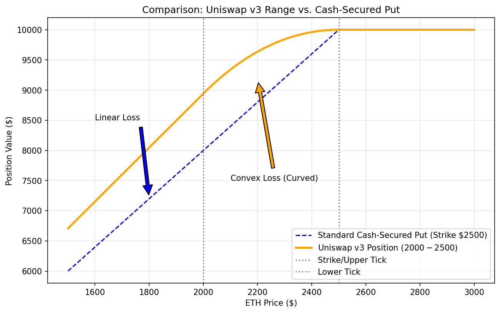

# Uniswap v3: Strategic Opportunities for Trading Business
## Technical Leadership Presentation

---

# Agenda

1. **What is Uniswap v3?** (5 min)
   - Brief technical overview
   - Key innovation: Concentrated liquidity

2. **LP Positions as Derivatives** (10 min)
   - Payoff structure comparisons
   - Greeks analysis

3. **Business Strategy** (15 min)
   - When to use Uniswap v3 vs traditional derivatives
   - Strategic opportunities
   - Risk considerations

4. **Recommendations** (5 min)

---

# What is Uniswap v3?

## Automated Market Maker (AMM)
- Decentralized exchange protocol
- No order book, no counterparty
- Algorithmic pricing: `x * y = k`

## Key Innovation: **Concentrated Liquidity**
- Liquidity providers (LPs) can specify **price ranges**
- Capital efficiency: 200x-4000x vs Uniswap v2
- Customizable risk/return profiles

## Market Position
- **$4B+ TVL** across all chains
- **Dominant DEX** by volume
- **Deep liquidity** in major pairs (ETH/USDC, ETH/USDT)

**Bottom Line**: Uniswap v3 is liquid, battle-tested DeFi infrastructure

---

# Technical Overview: How LP Positions Work

## Example: ETH/USDC Pool, Range $2000-$2500

**Entry at $2250 (mid-range):**
- Deposit: $10,000
- Position: ~2.2 ETH + $5,000 USDC

**As Price Changes:**
| ETH Price | Position Composition | Behavior |
|-----------|---------------------|----------|
| < $2000 | **100% ETH** | Out of range (no fees) |
| $2000-$2500 | **Mixed ETH/USDC** | Active (earning fees) |
| > $2500 | **100% USDC** | Out of range (no fees) |

**Automatic Rebalancing**: Protocol continuously sells ETH as price rises, buys as it falls

---

# The Business Insight: LP Positions ARE Derivatives

## Mathematical Analysis Reveals:

**Uniswap v3 LP positions have payoff structures identical to options strategies**

We analyzed 6 derivative strategies:
1. Cash-secured puts
2. Covered calls
3. Short straddles
4. Short strangles
5. Bull put / Bear call spreads
6. Collar strategies

**Key Finding**: LP positions behave like **selling options** with continuous rebalancing

---

# Payoff Comparison: LP vs Cash-Secured Put



**Entry at upper bound (all USDC) = Selling a cash-secured put**

**Similarities:**
- Start with cash/stablecoins
- Buy underlying as price falls
- Capped upside, exposed downside

**Differences:**
- LP: **Curved** payoff (convexity)
- Put: **Linear** payoff
- LP: Earn fees continuously vs premium upfront

---

# Payoff Comparison: LP vs Covered Call


**Entry at lower bound (all ETH) = Selling a covered call**

**Similarities:**
- Start with underlying asset (ETH)
- Upside capped at upper strike/tick
- Earn income (fees/premium)

**Differences:**
- LP: **Smooth** transition at cap
- Call: **Sharp** kink at strike
- LP: No expiration date

---

# Payoff Comparison: LP vs Collar Strategy


**Centered position = Protective collar**

**Similarities:**
- **Bounded risk**: Defined min/max values
- Protected downside, capped upside
- Range-defined payoff

**Differences:**
- Collar: Discrete option strikes (sharp boundaries)
- LP: Continuous rebalancing (smooth curves)

**Insight**: Both create "safety zones" with limited risk

---

# The Fundamental Trade-off: LP vs v2 vs HODL


**Three Strategies Compared:**

1. **HODL**: Linear, no impermanent loss
2. **Uniswap v2**: Always active, but always underperforms HODL
3. **Uniswap v3**: Concentrated, earns more fees but can go "out of range"

**The v3 Advantage**: Higher capital efficiency → More fees per dollar

**The v3 Risk**: If price exits range → Zero fees (but also zero IL)

---

# Greeks Analysis: The Risk Model


## LP Positions Have Options-Like Greeks:

**Delta (Δ)**: ETH exposure at each price
- Smooth decay in range
- Hedgeable via perpetuals/futures

**Gamma (Γ)**: **NEGATIVE** in range
- This IS impermanent loss
- "Buy high, sell low" rebalancing
- Source of losses in trending markets

**Theta (θ)**: Fee income over time
- Like positive theta from selling options
- No expiration (perpetual income)

**Vega (ν)**: Volatility exposure
- Good: High vol → More volume → More fees
- Bad: High vol → More rebalancing → More IL

---

# Delta Profile: Understanding Your Exposure


**Why This Matters for Trading:**

**Risk Management:**
- Know exact ETH exposure at any price
- Can hedge with perp futures
- Example: If Δ = 2.5 ETH, short 2.5 ETH perps to neutralize

**Position Dynamics:**
- In range: Delta decreases as price rises (automatic selling)
- Out of range: Constant delta (no rebalancing)

**vs Options**: Smooth curve vs sharp jumps at strikes

---

# Gamma Profile: The Source of IL


## Critical Discovery: **Negative Gamma = Impermanent Loss**

**What Negative Gamma Means:**
```
Price rises → Sell ETH (but at average price, not top)
Price falls → Buy ETH (but at average price, not bottom)
Result: Buy high, sell low on average
```

**Business Implication:**
- LP positions **lose** on price movement alone
- Must earn enough **fees** to offset gamma losses
- Like selling options: collect premium (fees) to compensate risk

**Out of Range**: Gamma ≈ 0 (no rebalancing, no IL, no fees)

---

# The Core Economics: Gamma vs Theta

## LP Position P&L Formula:

```
Total P&L = (Negative Gamma Losses) + (Positive Theta Income)
          = Impermanent Loss + Fee Revenue
```

**Profitable when: Fee Revenue > Impermanent Loss**

## Real-World Example: ETH/USDC 0.05% Pool

**30-day period, range $1800-$2200:**
- Impermanent loss: -$200 (price volatility)
- Fee income: +$450 (trading volume)
- **Net P&L: +$250** ✓

**Key Metric**: Fee APR must exceed IL rate

---

# When to Use Uniswap v3 vs Traditional Derivatives

## Use Uniswap v3 When:

✅ **Range-bound market view** (high vol, no trend)
- Collect fees while price oscillates
- Theta income offsets gamma losses

✅ **No good exchange-traded options available**
- Crypto options markets: illiquid, wide spreads
- LP provides "synthetic options" with better execution

✅ **Want continuous income without expiration**
- No theta decay to manage
- No roll costs
- Perpetual fee generation

✅ **Prefer decentralized, non-custodial exposure**
- No counterparty risk
- No margin calls
- Transparent, on-chain positions

---

# When to Use Traditional Options/Futures Instead

## Use Exchange-Traded Derivatives When:

✅ **Directional view** (bullish or bearish)
- Options spreads designed for directional bets
- LP is neutral (loses in trends)

✅ **Want defined max loss** (besides collar-like ranges)
- Buying options: loss capped at premium
- LP in trending market: unbounded IL

✅ **Need leverage without adding capital**
- Futures/options: built-in leverage
- LP: Must deposit full capital

✅ **Short-term tactical trade** (< 7 days)
- Insufficient time to earn meaningful fees
- Options better for event-driven trades

✅ **Very liquid options markets** (BTC, ETH on Deribit)
- Tighter spreads, better fills
- More strike choices, expiration dates

---

# Strategic Opportunities: Hybrid Strategies

## 1. **Delta-Hedged LP** (Pure Yield Play)

**Strategy:**
1. Deposit $100k in ETH/USDC LP (Δ = 25 ETH)
2. Short 25 ETH perps to neutralize price risk
3. Rehedge as delta changes

**Result:**
- Earn LP fees (theta income)
- No price risk (delta-neutral)
- Pay perp funding rates

**When Profitable**: LP fees > Perp funding costs

**Use Case**: Stable yield generation, no market view needed

---

## 2. **LP + Protective Options** (Downside Protection)

**Strategy:**
1. Deposit in LP range $2000-$2500
2. Buy $1800 put on exchange (tail risk protection)

**Result:**
- Earn LP fees in normal conditions
- Protected if price crashes below $1800
- Cost: Put premium

**Use Case**: Bull market positioning with crash insurance

---

## 3. **Multi-Range Portfolio** (Volatility Harvesting)

**Strategy:**
- Position 1: Tight range $1950-$2050 (high fees, high gamma)
- Position 2: Wide range $1500-$2500 (low fees, low gamma)
- Position 3: Out-of-money $2500-$3000 (option-like)

**Result:**
- Diversified gamma exposure
- Some positions always earning
- Smooth overall P&L curve

**Use Case**: Professional LP management, maximize fee capture

---

## 4. **Basis Trade Enhancement**

**Traditional Basis Trade:**
- Long spot ETH
- Short ETH futures
- Capture funding rate

**Enhanced with LP:**
- LP position (mixed ETH/USDC) instead of spot
- Short equivalent delta in futures
- Earn fees + funding rate

**Additional Return**: LP fees on top of basis yield

---

# Risk Considerations

## Operational Risks:

**Smart Contract Risk:**
- Uniswap v3: Battle-tested, audited, $4B+ TVL
- But: DeFi protocols can have bugs
- Mitigation: Position sizing, diversification

**Gas Costs:**
- High gas on Ethereum L1 ($50-$200 per transaction)
- LP position changes expensive
- Mitigation: Use L2s (Arbitrum, Optimism), size positions accordingly

**Impermanent Loss:**
- Negative gamma guaranteed in range
- Can exceed fee income in trending markets
- Mitigation: Active management, range adjustment

---

## Market Risks:

**Going Out of Range:**
- Price exits range → Zero fees
- Capital sitting idle
- Mitigation: Wider ranges, active rebalancing

**Fee Tier Selection:**
- 0.05% tier: High competition, lower fees per trade
- 1% tier: Low competition, but less volume
- Must match tier to asset volatility

**Liquidity Risk:**
- Cannot instant exit large positions
- Must wait for swaps to withdraw
- Mitigation: Size appropriately, maintain some liquid reserves

---

## Comparison Matrix: Uniswap v3 vs Traditional Derivatives

| Factor | Uniswap v3 LP | Options | Futures |
|--------|---------------|---------|---------|
| **Liquidity** | Good (major pairs) | Varies (best: BTC/ETH) | Excellent |
| **Execution** | Instant (on-chain) | Exchange-dependent | Excellent |
| **Capital Efficiency** | Medium (full collateral) | High (premium only) | Very High (leverage) |
| **Expiration** | None (perpetual) | Fixed dates | Quarterly/Perpetual |
| **Counterparty Risk** | None (protocol risk) | Exchange risk | Exchange risk |
| **Complexity** | Medium | Medium-High | Low |
| **Fee Income** | Yes (continuous) | Upfront premium | Funding rate |
| **Greeks Exposure** | Short gamma + Theta | Customizable | Delta only |
| **Trending Markets** | Bad (IL) | Can profit | Excellent |
| **Range-Bound Markets** | Excellent | Good (theta decay) | Poor |
| **Regulatory** | DeFi (unclear) | Regulated exchanges | Regulated |

---

# Business Model: When Uniswap v3 Adds Value

## Market Making Revenue Streams:

**Traditional Market Making:**
- Bid-ask spread capture
- Inventory risk management
- High frequency, tight spreads

**LP Market Making:**
- Fee capture from swaps
- Automatic rebalancing (no manual trading)
- Passive, works 24/7

## Complementary, Not Replacement:

**Use Both:**
1. **Traditional MM** on CEX for tight spreads, high volume
2. **LP positions** on Uniswap for passive fee yield
3. **Delta hedge** LP with CEX futures

**Combined Alpha**: CEX spreads + DEX fees + Basis yields

---

# Quantitative Framework: When to Deploy Capital

## Decision Model:

```python
Expected LP Return = (Fee APR) - (Expected IL Rate) - (Gas Costs)

Where:
  Fee APR = (24h fees / TVL) * 365
  Expected IL Rate = f(volatility, range_width)
  Gas Costs = (entry + exit + rebalancing) / capital
```

## Profitability Conditions:

**Minimum Fee APR Required:**
```
Required APR > Expected Volatility² * Gamma_Exposure + Gas_Costs

For ETH/USDC (30% vol, $10k position):
  Required APR > ~15% + 2% = 17%

Current ETH/USDC 0.05% pool: ~20-40% APR ✓
```

**Green Light**: Deploy when current fee APR > required threshold

---

# Strategic Recommendations

## Immediate Actions (0-30 days):

1. **Pilot Program**: Deploy $50-100k in ETH/USDC LP
   - Range: Tight around current price
   - Track: Daily fees, IL, net P&L
   - Learn: Operational mechanics, gas costs

2. **Build Analytics**: Dashboard for LP positions
   - Real-time Greeks (delta, gamma)
   - Fee APR tracking
   - IL monitoring vs HODL benchmark

3. **Delta Hedging Test**: Neutralize pilot position
   - Hedge with perp futures
   - Measure: Net yield (LP fees - funding costs)

---

## Medium-Term Strategy (1-6 months):

1. **Scale if Profitable**: Increase to $500k-$1M
   - Multiple ranges (risk diversification)
   - Different pools (ETH/USDC, ETH/USDT, BTC/USDC)

2. **Integration with Existing Trading**:
   - Use LP positions for basis trade enhancement
   - Combine with options strategies (hybrid positions)
   - Build automated rebalancing (move ranges with price)

3. **Advanced Strategies**:
   - Multi-range portfolio optimization
   - Dynamic range adjustment based on vol
   - Cross-venue arbitrage (CEX vs DEX)

---

## Long-Term Opportunities (6+ months):

1. **Proprietary LP Strategies**:
   - Machine learning for optimal ranges
   - Volatility forecasting for position sizing
   - Automated gamma/theta management

2. **Client Solutions** (if applicable):
   - Offer LP-as-a-service
   - Structured products using LP positions
   - DeFi yield products for institutional clients

3. **Market Expansion**:
   - L2 deployment (lower gas costs)
   - New token pairs (higher fees, higher risk)
   - Cross-chain LP positions

---

# Risk Mitigation Plan

## Position Limits:
- Max 5% of trading capital in LP initially
- Max 20% after proven profitability
- No single pool > $1M (concentration risk)

## Monitoring Requirements:
- **Daily**: Fee earnings, IL, delta exposure
- **Weekly**: Range effectiveness, rebalancing needs
- **Monthly**: Strategy P&L vs benchmarks

## Exit Triggers:
- Fee APR drops below 15%
- IL exceeds 10% of position value
- Smart contract exploit in Uniswap ecosystem
- Regulatory concerns emerge

## Governance:
- Risk committee approval for > $500k deployment
- Monthly strategy review
- Quarterly board reporting

---

# Comparison to Current Options Strategy

## If You Currently Trade Options:

**Uniswap v3 Can:**
- ✅ Replace short straddle/strangle positions (better execution in crypto)
- ✅ Replace covered calls on held ETH (continuous income)
- ✅ Provide theta income without rolling (no expiration management)

**Uniswap v3 Cannot:**
- ❌ Replace directional bets (spreads, outright calls/puts)
- ❌ Provide defined-risk long positions
- ❌ Match CEX liquidity for BTC/ETH

## Recommended Allocation:

**Conservative**: 10% of options capital to LP (test phase)
**Moderate**: 25% of theta strategies to LP (proven profitable)
**Aggressive**: 40-50% neutral strategies to LP (full integration)

---

# Expected Returns Analysis

## Base Case (ETH/USDC 0.05%, $100k position):

**Assumptions:**
- Price stays in range 70% of time
- Average fee APR: 25%
- Expected IL: ~8% annualized (moderate volatility)
- Gas costs: ~2% (L1 Ethereum)

**Expected Annual Return:**
```
Fee Income:     $100k * 25% * 70% = $17,500
Impermanent Loss:  $100k * -8%    = -$8,000
Gas Costs:         $100k * -2%    = -$2,000
────────────────────────────────────────
Net Return:                        $7,500
ROI:                               7.5%
```

**Risk-Adjusted**: ~10-12% Sharpe ratio (comparable to vol selling strategies)

---

## Bull Case (High volume, tight range):

**Assumptions:**
- Price oscillates in range 85% of time
- Fee APR spikes to 40% (high volume period)
- Lower IL: 5% (range-bound)
- L2 deployment: <1% gas

**Expected Annual Return:**
```
Fee Income:     $100k * 40% * 85% = $34,000
Impermanent Loss:  $100k * -5%    = -$5,000
Gas Costs:         $100k * -1%    = -$1,000
────────────────────────────────────────
Net Return:                        $28,000
ROI:                               28%
```

---

## Bear Case (Trending market):

**Assumptions:**
- Price exits range quickly
- Active for only 40% of time
- Fee APR drops to 15%
- High IL: 15% (strong trend)

**Expected Annual Return:**
```
Fee Income:     $100k * 15% * 40% = $6,000
Impermanent Loss:  $100k * -15%   = -$15,000
Gas Costs:         $100k * -2%    = -$2,000
────────────────────────────────────────
Net Return:                        -$11,000
ROI:                               -11%
```

**Mitigation**: Active management, wider ranges, or exit during trends

---

# Competitive Advantage

## Why This Matters Now:

**1. Institutional DeFi Adoption Accelerating**
- Coinbase, Fidelity, BlackRock entering DeFi
- Regulatory clarity improving
- Infrastructure maturing (custody, compliance)

**2. CEX Options Markets Still Immature**
- Limited liquidity outside BTC/ETH
- Poor execution for alt coins
- High counterparty risk (FTX, etc.)

**3. Yield Opportunities Expanding**
- Traditional finance rates low
- DeFi yields competitive
- Early movers capture advantages

**Strategic Position**: Build expertise now, scale when institutional flows arrive

---

# Technical Requirements

## Infrastructure Needed:

**Minimal (Pilot):**
- Custodial wallet (MetaMask, Gnosis Safe)
- Etherscan monitoring
- Manual position management

**Professional (Scale):**
- Institutional custody (Fireblocks, Anchorage)
- Automated monitoring/alerts
- API integration for hedging
- Gas optimization tools
- Accounting/tax infrastructure

**Advanced (Optimization):**
- Smart contract automation (rebalancing)
- Real-time analytics dashboard
- Cross-chain position management
- Proprietary strategy engine

**Build vs Buy**: Most infrastructure available as SaaS (Alchemy, Dune Analytics, etc.)

---

# Regulatory & Compliance Considerations

## Current Status:

**Uniswap v3:**
- Decentralized protocol (no KYC/AML at protocol level)
- Frontend might restrict regions
- Treated as property/commodity in most jurisdictions

**Considerations:**
- **Tax Treatment**: LP positions = property, swaps = taxable events
- **Reporting**: Must track cost basis, IL, fees
- **AML Concerns**: Source of funds for DeFi deployment
- **Custody**: Qualified custodian for institutional capital

**Recommendation**: Legal/compliance review before scaling beyond pilot

---

# Success Metrics

## Track These KPIs:

**Performance Metrics:**
- [ ] Daily Fee APR (target: >20%)
- [ ] Cumulative IL vs HODL (target: <10%)
- [ ] Net ROI (target: >15% annualized)
- [ ] Win rate (profitable months / total months) (target: >70%)

**Operational Metrics:**
- [ ] Time in range (target: >60%)
- [ ] Gas costs as % of returns (target: <5%)
- [ ] Hedging efficiency (if delta-neutral) (target: <2% tracking error)
- [ ] Rebalancing frequency (target: <2x per month)

**Risk Metrics:**
- [ ] Max drawdown vs HODL (target: <15%)
- [ ] Greeks exposure (delta, gamma within limits)
- [ ] Capital at risk in smart contracts (target: <20% total capital)

---

# Key Takeaways

## 1. **LP Positions ARE Derivatives**
- Mathematically equivalent to selling options
- Short gamma (IL) + Positive theta (fees)
- Quantifiable with options Greeks

## 2. **Different Use Case than Traditional Derivatives**
- Best for: Range-bound, high-volatility, no directional view
- Worst for: Trending markets, directional bets
- Complementary to existing options/futures strategies

## 3. **Compelling Economics** (when used correctly)
- 15-30% APR possible in good conditions
- Better than options for illiquid crypto pairs
- 24/7 passive income, no expiration management

## 4. **Manageable Risks**
- Smart contract risk: Mitigated by Uniswap's track record
- Market risk: Manageable with Greeks framework
- Operational risk: Solvable with proper infrastructure

---

# Recommendation: Proceed with Pilot

## Proposed Action Plan:

**Phase 1 (Month 1-2): Pilot**
- Deploy $100k in ETH/USDC
- Build monitoring infrastructure
- Validate economics in real market

**Phase 2 (Month 3-4): Optimization**
- Test delta hedging strategies
- Experiment with range widths
- Refine operational processes

**Phase 3 (Month 5-6): Scale Decision**
- Review 6-month P&L
- If profitable: Scale to $500k-$1M
- If not: Document learnings, small position or exit

**Investment Required:**
- Capital: $100k (pilot)
- Engineering: 1 developer, 2 weeks (monitoring tools)
- Operations: 0.25 FTE (daily management)

**Expected Payoff**: 15-25% ROI if thesis plays out, valuable DeFi expertise regardless

---

# Questions for Discussion

1. **Risk Appetite**: What % of capital should pilot represent?

2. **Integration**: How does this fit with current options strategies?

3. **Infrastructure**: Build in-house or use third-party tools?

4. **Timeline**: Comfortable with 6-month pilot horizon?

5. **Team**: Who owns this initiative (trading desk vs research)?

6. **Success Criteria**: What metrics determine go/no-go for scaling?

---

# Appendix: Additional Resources

## Research Materials:
- All payoff comparison graphs (plots 1-F)
- Greeks analysis visualizations (plots G-I)
- Detailed Greeks analysis guide (300+ pages)
- Formula verification scripts

## Further Reading:
- Uniswap v3 whitepaper
- Impermanent loss academic papers
- DeFi options market analysis
- Regulatory landscape overview

## Demos Available:
- Live position monitoring dashboard
- Greeks calculator tool
- IL vs fee simulator
- Range optimization model

---

# Thank You

## Questions?

---

**Contact for Follow-up:**
- Technical questions: [Engineering lead]
- Business strategy: [Product/Trading lead]
- Risk/Compliance: [Risk management]

**Next Steps:**
- [ ] Risk committee approval
- [ ] Legal/compliance review
- [ ] Pilot allocation approved
- [ ] Infrastructure development begins
- [ ] Target launch: [Date]
