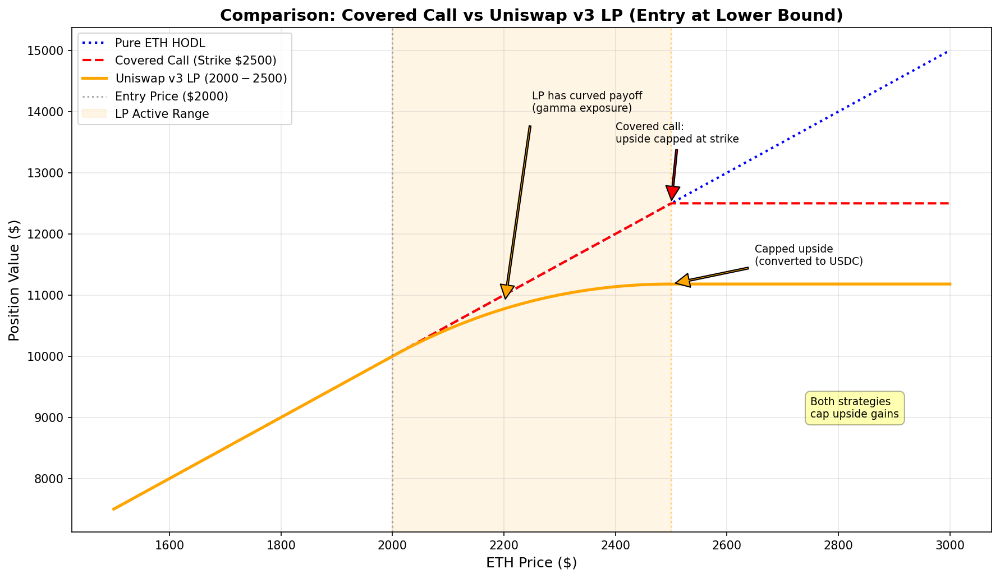
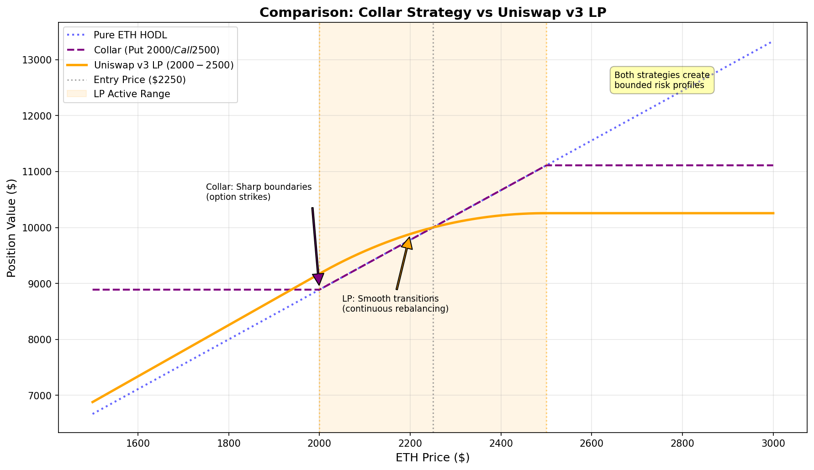
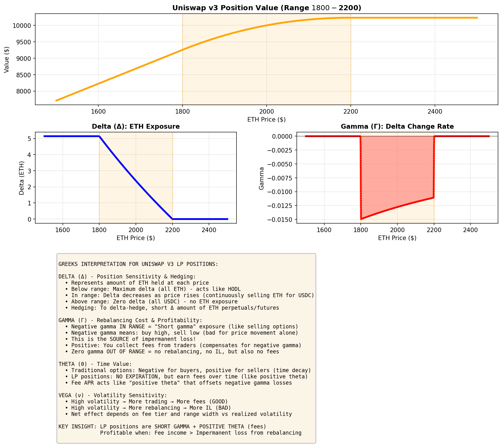

# Uniswap v3 Liquidity Positions: A New Derivative in Our Toolbox
## 10-15 Minute Technical Leadership Update

---

# Overview

**What's Happening**: Trading desk integrating Uniswap v3 LP positions as a new derivative instrument

**Why It Matters**: Clients need on-chain liquidity. LP positions are mathematically identical to options strategies we already trade.

**Strategic Context**: Crypto derivatives are maturing into real instruments with proper risk frameworks. We're building the expertise to work with them.

---

# Why On-Chain Liquidity Matters

**Client Reality**:
- Some clients need liquidity on-chain (regulatory, custody, transparency)
- DeFi protocols need professional market making
- Can't tell clients "we don't do on-chain"

**Market Maturity**:
- Uniswap v3: $4B TVL, 3+ years battle-tested
- Professional infrastructure available
- No longer experimental—it's production-grade

**Bottom Line**: Expanding our derivative capabilities to meet client needs

---

# What is Uniswap v3?

**Automated Market Maker** with concentrated liquidity
- $4B+ TVL across Ethereum, Avalanche, Arbitrum, Optimism
- Deploy token pairs in a **price range** (e.g., AVAX/USDC $25-$35)
- Earn fees from swaps, protocol automatically rebalances

**Capital Efficiency**:
- 200-4000x better than Uniswap v2
- Tighter ranges = Higher fee capture
- Professional-grade tool

---

# The Core Discovery: LP Positions ARE Derivatives

**We analyzed the math and found perfect matches to traditional options**

**Entry at lower bound = Covered Call**:
- Buy underlying, cap upside, earn income
- Same payoff structure, continuous rebalancing

**This isn't analogous—it's mathematically identical**

---

# LP = Selling Options Strategies

**Tested against 6 derivative strategies**:
✓ Covered calls
✓ Cash-secured puts
✓ Protective collars
✓ Short straddles / strangles
✓ Credit spreads

**All map precisely to LP positions with different configurations**

**Implication**: We already know how to price, hedge, and risk-manage these.

---

# Greeks Framework: Same Risk Management

**Delta (Δ)** - Position Sensitivity:
- Below range: Maximum delta (all ETH)
- In range: Delta decreases as price rises (selling ETH)
- Above range: Zero delta (all USDC)
- Hedge with perpetual futures (short Δ amount of ETH)

**Gamma (Γ)** - Rebalancing Cost:
- **Negative in range** = short gamma exposure (like selling options)
- **Automatic rebalancing** (in range): Protocol continuously buys high/sells low as price moves
  - Creates impermanent loss (unrealized while in range)
  - Offset by fee income from trading volume
- **Manual rebalancing** (out of range): When price exits our range
  - Must close position or reset range to stay active
  - Crystallizes/realizes the losses from automatic rebalancing
  - Decision point: Are fees earned > losses incurred?

**Theta (θ)** - Fee Income:
- No expiration, but earn fees over time (like positive theta)
- Fee APR offsets negative gamma losses
- Profitable when: Fee income > Impermanent loss

**Vega (ν)** - Volatility Sensitivity:
- High vol → More trading → More fees (GOOD)
- High vol → More rebalancing → More IL (BAD)
- Net depends on fee tier vs realized volatility

**Key Insight**: LP = Short Gamma + Positive Theta. Same risk/reward as selling options.

**We already manage these Greeks daily. This is just another venue.**

---

# The Strategy: Delta-Hedged LP

**Core Approach**:
1. Deploy capital in LP position (generates delta exposure)
2. Hedge delta with perpetual futures
3. Net result: Earn fees minus funding costs
4. Delta-neutral, volatility selling strategy

**This is volatility arbitrage**:
- Sell implied vol (LP fees: 15-30% APR)
- Pay realized vol (funding: 5-10%)
- Pocket the difference (net: 10-20% delta-neutral)

**Risk Management**:
- Greeks-based position sizing (same as options book)
- Cross-venue hedging (CEX + DEX)
- Exit or widen ranges in trending markets

**Same concept as basis trades, funding arbitrage, vol selling we already do**

---

# When to Use LP vs Traditional Derivatives

**Use LP Positions**:
✓ On-chain execution required
✓ Range-bound volatile markets (high fees offset IL)
✓ Pairs without liquid options markets
✓ Continuous yield without expiration management

**Use Traditional Options/Futures**:
✓ Directional views (LP is neutral)
✓ Short-term tactical trades
✓ Need leverage without full capital

**Use Both**:
✓ CEX futures to hedge DEX LP positions
✓ Cross-venue arbitrage
✓ Integrated book management

**Key Point**: Complementary tools. Use the right instrument for each situation.

---

# What We're Doing: $1M Initiative

**Deployment**:
- $1M starting with AVAX/USDC on Avalanche
- Build monitoring, Greeks calculation, hedging automation
- Document operational playbooks and best practices

**What We're NOT Doing**:
- ❌ Betting on crypto prices
- ❌ Speculating on DeFi tokens
- ❌ Running unhedged positions

**What We ARE Doing**:
- ✅ Building capability with a new derivative class
- ✅ Applying existing risk frameworks to new venues
- ✅ Responding to client needs for on-chain execution
- ✅ Treating this as seriously as any other derivative

**Goal**: LP positions become just another instrument we work with professionally

---

# Why Now: Crypto Market Maturation

**2017-2020**: Wild West - No professional tools, high speculation

**2021-2023**: Infrastructure Building - Custody, regulatory frameworks emerging

**2024-2026**: Legitimization ← **We are here**
- Real derivatives with proper math
- Institutional-grade infrastructure
- $4B+ in production, battle-tested

**2027+**: Standardization - Crypto derivatives as normal as FX derivatives

**Our Position**: Build expertise during legitimization, ready for standardization

**Key Point**: Crypto is becoming a real asset class. We need to treat it seriously, not dismiss it.

---

# Key Takeaways

**1. LP Positions ARE Derivatives**
- Mathematically identical to selling options
- Same Greeks, same risk framework
- Different execution venue (on-chain vs exchange)

**2. This is Capability Building**
- New tool in our derivative toolkit
- Respond to client needs
- Be ready as markets mature

**3. We're Applying Existing Expertise**
- Traditional risk management on new instruments
- Same rigor, same discipline, new venue

**4. Integration is Key**
- LP positions complement existing derivatives
- CEX + DEX = fuller toolkit
- Cross-venue opportunities

**We're not chasing DeFi trends. We're building competency with instruments that clients need and markets are demanding.**

---

# Questions & Discussion

**For Detailed Questions**:
- Technical strategy: [Trading desk lead]
- Risk framework: [Risk management]
- Infrastructure: [Engineering lead]

**Supporting Materials**:
- Full Greeks analysis documentation
- Mathematical verification
- All payoff comparison graphs

---

**Thank you. Building for where markets are going.**
