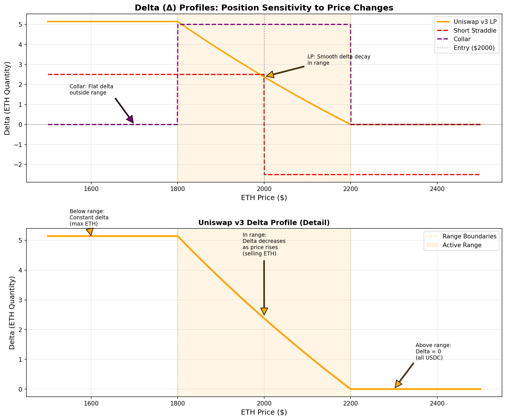
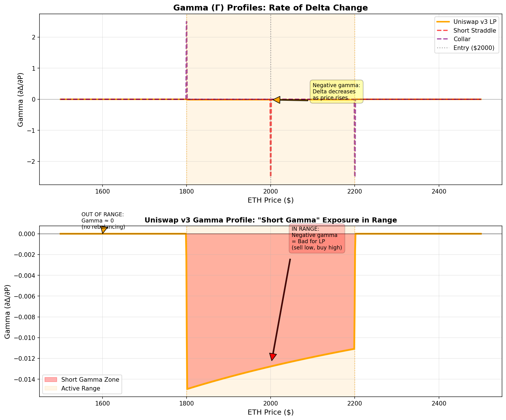
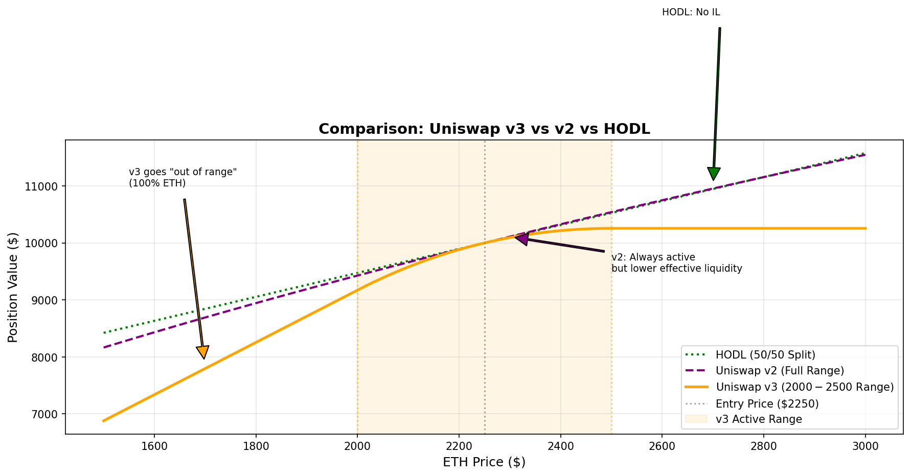

# Uniswap v3 Liquidity Positions: A New Derivative in Our Toolbox
## 15-Minute Technical Leadership Update

---

# Overview

**What's Happening**: Trading desk integrating Uniswap v3 LP positions as a new derivative instrument

**Why It Matters**: Clients need on-chain liquidity solutions. We need to understand and manage these instruments professionally.

**The Discovery**: LP positions are mathematically equivalent to options strategies we already trade

**Strategic Context**: Crypto is maturing. Real derivatives with real risk frameworks are emerging. We're building the expertise to work with them.

---

# Why On-Chain Liquidity Matters Now

**Client Reality**:
- Some clients want liquidity on-chain (regulatory, custody, transparency reasons)
- DeFi protocols need professional market making
- We need to serve these needs with the same rigor as CEX trading

**Market Maturity**:
- Uniswap v3: $4B TVL, 3+ years battle-tested
- Professional infrastructure available (custody, monitoring, compliance)
- No longer experimental—it's production-grade

**Our Imperative**:
- Can't tell clients "we don't do on-chain"
- Need to understand these instruments regardless
- Crypto is becoming real—we need to treat it seriously

**Bottom Line**: This is about expanding our derivative capabilities, not chasing a trend

---

# What is Uniswap v3?

**Automated Market Maker** with concentrated liquidity
- Decentralized exchange protocol
- $4B+ TVL, dominant by volume
- Deep liquidity in major pairs (ETH/USDC: $400M+)

**How It Works**:
- Deposit token pairs in a **price range** (e.g., ETH/USDC $2000-$2500)
- Earn fees from every swap in that range
- Protocol automatically rebalances (sells as price rises, buys as falls)

**Capital Efficiency**:
- 200-4000x better than Uniswap v2
- Tighter ranges = More concentrated liquidity = Higher fee capture
- Professional-grade tool, not retail DeFi toy

**Key Point**: This is infrastructure for on-chain derivatives, similar to how CME is infrastructure for futures

---

# The Core Discovery: LP Positions ARE Derivatives


**We analyzed the math and found perfect matches to traditional options**

**Entry at lower bound (all ETH) = Covered Call**:
- Buy underlying, cap upside, earn income
- Same payoff structure, just continuous rebalancing instead of discrete expiration

**This isn't analogous—it's mathematically identical**

---

# LP = Selling Options Strategies


**We tested against 6 derivative strategies**:
✓ Covered calls
✓ Cash-secured puts
✓ Protective collars
✓ Short straddles
✓ Short strangles
✓ Credit spreads

**All map precisely to LP positions with different entry points and range configurations**

**Implication**: We already know how to price, hedge, and risk-manage these. They're just executed on-chain instead of through exchanges.

---

# Greeks Framework: Same Tools, New Venue


**Delta (Δ)**: Token exposure
- Smooth decay as price moves through range
- Hedge with perp futures (same as options)

**Gamma (Γ)**: **Negative** in range
- This IS impermanent loss
- Short gamma = losses from rebalancing
- Same risk as selling options

**Theta (θ)**: Fee income
- Positive theta (like collecting option premium)
- No expiration—perpetual income stream

**Vega (ν)**: Volatility exposure
- High vol → More volume → More fees (good)
- High vol → More rebalancing → More IL (bad)
- Net depends on regime

**We already manage these Greeks daily. This is just another venue.**

---

# Delta Profile: Understanding Position Dynamics



**Delta represents token exposure at each price level**

**Below range**: Constant delta (all ETH) - No rebalancing
**In range**: Delta decreases as price rises - Automatic selling
**Above range**: Zero delta (all stablecoin) - Fully converted

**Risk Management**:
- Know exact exposure at any price
- Can hedge with perps/futures
- Dynamic, continuous adjustment

**This is automatic portfolio rebalancing with a defined risk profile**

---

# Gamma Profile: The Source of IL



**Negative gamma in range = Impermanent loss**

**What this means**:
```
Price rises → Sell ETH at average (not top)
Price falls → Buy ETH at average (not bottom)
Result: Buy high, sell low = Loss from rebalancing
```

**This is identical to short gamma in options**:
- Lose in trending markets
- Need theta (fees) to offset
- Position sizing based on expected volatility

**We understand this risk. We price it. We manage it.**

---

# The LP vs v2 vs HODL Comparison



**Three approaches to token exposure**:

**HODL**: No IL, but no income. Linear exposure.

**Uniswap v2**: Always active, always has IL, lower capital efficiency

**Uniswap v3**: Concentrated range
- Higher fees when in range
- Can go "out of range" (no fees, no IL)
- Flexible risk/return profile

**Key Insight**: v3 gives us range-selection capability. We can construct different exposure profiles, just like choosing option strikes.

---

# Why This Matters: Crypto Derivatives are Maturing

**Where We Were (2020-2022)**:
- DeFi = speculation, hacks, ponzi schemes
- No professional tools
- No institutional infrastructure

**Where We Are (2024-2025)**:
- Real derivatives with real math
- Professional custody and monitoring
- Institutional-grade infrastructure
- $4B+ in production, 3+ years live

**What This Means**:
- Crypto is becoming a legitimate asset class
- Derivatives are standardizing
- Professional firms need to understand these tools
- This is infrastructure, not speculation

**We need to be where markets are going, not where they were**

---

# Our Approach: Treat It Like Any Other Derivative

**What We're Doing**:
1. **$1M deployment** across multiple positions (ETH/USDC, ETH/USDT, BTC/USDC)
2. **Build infrastructure**: Monitoring, Greeks calculation, hedging automation
3. **Develop expertise**: Understand the instrument, document best practices
4. **Integrate with existing trading**: Use CEX positions to hedge DEX exposure

**What We're NOT Doing**:
- ❌ Betting on crypto prices going up
- ❌ Speculating on DeFi tokens
- ❌ Running unhedged directional positions
- ❌ Treating this as experimental side project

**What We ARE Doing**:
- ✅ Building capability with a new derivative class
- ✅ Applying existing risk frameworks to new venues
- ✅ Responding to client needs for on-chain execution
- ✅ Expanding our toolkit as markets evolve

---

# Risk Management: Same Framework, New Instrument

**Greeks-Based Position Sizing**:
- Size based on gamma exposure and expected volatility
- Just like options book management
- Same risk metrics, same limits

**Hedging Capabilities**:
- Delta hedge with perpetual futures
- Cross-venue risk management (CEX + DEX)
- Dynamic rebalancing

**Operational Risk**:
- Smart contract: Uniswap has $4B TVL, 3+ years live
- Custody: Institutional providers available
- Monitoring: 24/7 automated alerts

**Position Limits**:
- Max position sizes per pool
- Correlation limits across positions
- Same governance as other derivative books

**This fits within our existing risk framework. Not a special case.**

---

# The Strategy: Delta-Hedged LP

**The Core Approach**:
1. Deploy capital in LP position (generates delta exposure)
2. Hedge delta with perpetual futures
3. Net result: Earn fees minus funding costs
4. Delta-neutral, volatility selling strategy

**Why This Works**:
- LP fees: 15-30% APR (actual current rates)
- Funding costs: 5-10% (variable)
- Net yield: 10-20% delta-neutral

**This is volatility arbitrage**:
- Sell implied vol (LP fees)
- Pay realized vol (funding)
- Pocket the difference

**Same concept as basis trades, funding arbitrage, vol selling we already do**

---

# Expected Performance: Based on Live Data

**Base Case** (Current market conditions):
- ETH/USDC 0.05% pool: 25% APR (30-day actual average)
- Impermanent loss: -8% (moderate volatility)
- Hedging costs: -5% (perp funding)
- **Net: ~12% yield**

**Bull Case** (High volume, range-bound):
- Pool APR: 40% (seen during vol spikes)
- IL: -5% (oscillating but not trending)
- Hedging: -3%
- **Net: ~32% yield**

**Bear Case** (Trending market):
- Pool APR: 15% (low volume)
- IL: -15% (strong trend)
- Hedging: -7%
- **Net: -7% loss**

**Risk Management**: Exit or widen ranges in trending markets, just like we adjust options strategies in low-vol environments

---

# When to Use LP vs Traditional Derivatives

**Use LP Positions**:
✓ On-chain execution required (client needs, regulatory)
✓ Range-bound volatile markets (high fees offset IL)
✓ Pairs without liquid options markets (most altcoins)
✓ Continuous yield without expiration management

**Use Traditional Options/Futures**:
✓ Directional views (LP is neutral)
✓ Short-term tactical trades (<1 week)
✓ Need leverage without full capital
✓ Very liquid markets (BTC/ETH on exchanges)

**Use Both**:
✓ CEX futures to hedge DEX LP positions
✓ Cross-venue arbitrage opportunities
✓ Integrated book management

**Key Point**: These are complementary tools. We use the right instrument for each situation.

---

# The $1M Initiative: Building Capability

**Phase 1 (Current - Month 3)**: Infrastructure & Learning
- Deploy $1M across 3-5 positions
- Build monitoring and analytics systems
- Document operational playbooks
- Develop pricing models and Greeks calculators

**Phase 2 (Month 4-6)**: Integration & Optimization
- Integrate with existing hedging workflows
- Test cross-venue strategies
- Refine range selection algorithms
- Build client reporting templates

**Phase 3 (Month 7-12)**: Production & Scale
- Scale to larger positions as expertise grows
- Offer as service for clients who need it
- Full integration with trading desk operations
- Team expertise fully developed

**Goal**: By end of year, LP positions are just another instrument we work with professionally

---

# Technical Infrastructure Requirements

**What We're Building**:

**Monitoring & Analytics**:
- Real-time position tracking
- Greeks calculation engine
- P&L attribution (fees vs IL vs hedging)
- Alert system for range boundaries

**Execution & Hedging**:
- Automated delta hedging
- Cross-venue position management
- Rebalancing logic for range adjustments
- Gas optimization for L1/L2

**Risk & Reporting**:
- Position limits and compliance
- Daily risk reports
- Client-facing dashboards
- Audit trail for all operations

**Most tools available as SaaS** (Dune Analytics, Alchemy, etc.) - Not building from scratch

---

# Success Metrics: How We're Measuring

**Operational Metrics**:
- [ ] Sharpe ratio > 1.5 on hedged positions
- [ ] Uptime > 99% (monitoring systems)
- [ ] Range effectiveness (time in range > 60%)
- [ ] Hedging efficiency (tracking error < 2%)

**Financial Metrics**:
- [ ] Net yield (after hedging) > 10%
- [ ] Max drawdown < 15% vs HODL
- [ ] Fee capture efficiency
- [ ] Gas costs < 5% of returns

**Strategic Metrics**:
- [ ] Team expertise developed (documented playbooks)
- [ ] Client capabilities established (can serve on-chain needs)
- [ ] Infrastructure operational (automated workflows)
- [ ] Integration complete (seamless with existing trading)

**Timeline**: 12-month evaluation, quarterly reviews

---

# What Leadership Should Know

**This is NOT**:
❌ A bet on crypto going up
❌ A side project or experiment
❌ A departure from our core business
❌ Unhedged speculation on DeFi tokens

**This IS**:
✅ **Adding a new derivative to our toolbox**
✅ **Responding to client needs** (on-chain execution)
✅ **Building expertise** as crypto markets mature
✅ **Applying existing risk frameworks** to new venues

**Why Now**:
- Crypto derivatives are real and standardizing
- Infrastructure is mature enough for professional use
- Clients need this capability
- Better to build expertise now than scramble later

**What We Need**:
- Continued support for infrastructure development
- Recognition this is strategic capability building
- Resources for team training and documentation

---

# The Bigger Picture: Crypto Market Maturation

**2017-2020**: Wild West
- No professional tools
- High risk, high speculation
- Institutional avoidance

**2021-2023**: Infrastructure Building
- Custody solutions emerge
- Regulatory frameworks developing
- Professional firms exploring

**2024-2026**: Legitimization ← We are here
- Real derivatives with proper math
- Institutional-grade infrastructure
- Traditional finance integration

**2027+**: Standardization
- Crypto derivatives as normal as FX derivatives
- Integrated into all trading operations
- Standard risk frameworks apply

**Our Position**: Build expertise during legitimization phase, ready for standardization phase

---

# Key Takeaways

**1. LP Positions ARE Derivatives**
- Mathematically identical to selling options
- Same Greeks, same risk management framework
- Just different execution venue (on-chain vs exchange)

**2. This is About Capability Building**
- New tool in our derivative toolkit
- Respond to client needs for on-chain execution
- Be ready as crypto markets mature

**3. We're Applying Existing Expertise**
- Not learning crypto speculation
- Using traditional risk management on new instruments
- Same rigor, same discipline, new venue

**4. Crypto is Maturing**
- Real derivatives infrastructure exists
- Professional tools are available
- Time to treat seriously, not dismiss

**5. Integration is Key**
- LP positions complement existing derivatives
- CEX + DEX = fuller toolkit
- Cross-venue opportunities

**We're not chasing the next DeFi trend. We're building competency with instruments that clients need and markets are demanding.**

---

# Questions & Discussion

**For Detailed Questions**:
- Technical strategy: [Trading desk lead]
- Risk framework: [Risk management]
- Infrastructure: [Engineering lead]
- Operations: [Operations team]

**Supporting Materials**:
- Full Greeks analysis (300+ pages)
- Mathematical verification
- Risk management documentation
- All payoff comparison graphs

---

**Thank you. Building for where markets are going.**
